# Architecture & Flow Diagrams

Tài liệu này mô tả kiến trúc hệ thống và các flow diagram của edgeos-api.

## API → AI Runtime → SDK

Edge AI API định vị là **nền tảng Edge AI** (REST API + xử lý AI). CVEDIX SDK là tầng hỗ trợ; mọi luồng AI đi qua lớp **AI Runtime** (decode, inference, cache).

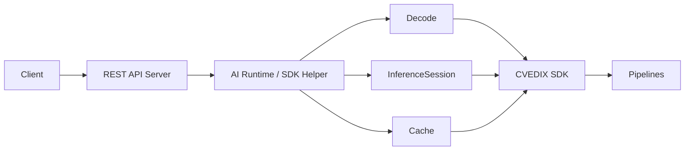

**Thành phần AI Runtime:**
- **InferenceSession** — Load/unload model, infer (face detector + recognizer).
- **AIRuntimeFacade** — Request (payload, codec, model_key) → decode → cache? → infer → response.
- **PipelineHelper** — Pipeline ngắn: frame → detector → callback (không dùng InstanceRegistry).

Recognition và Push frame dùng chung decode + infer qua facade/session. Xem [AI_RUNTIME_DESIGN.md](AI_RUNTIME_DESIGN.md).

## System Architecture

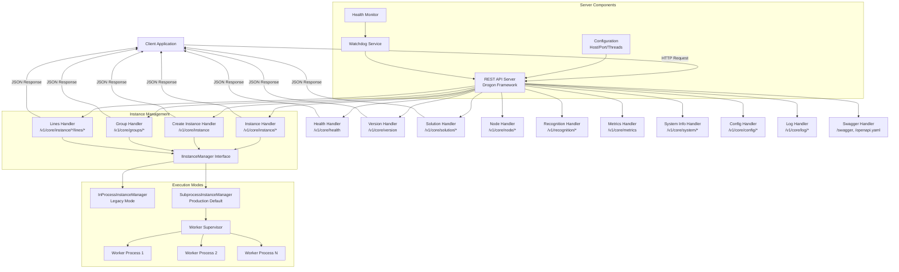

## Request Flow

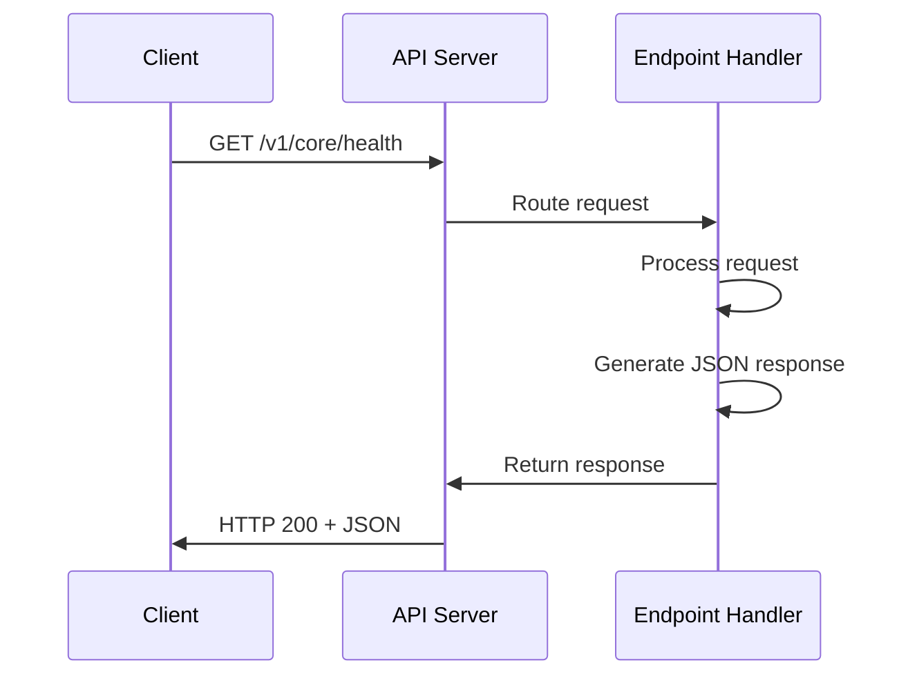

## Component Structure

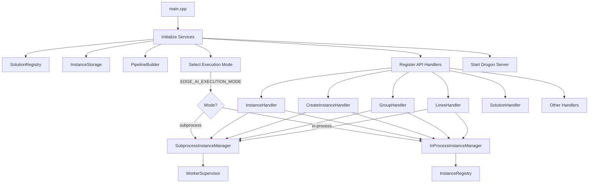

---

## Flow Tổng Quan Hệ Thống

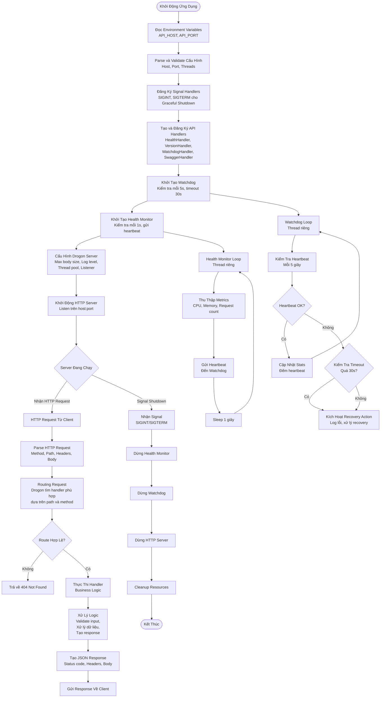

## Flow Xử Lý Request Chi Tiết

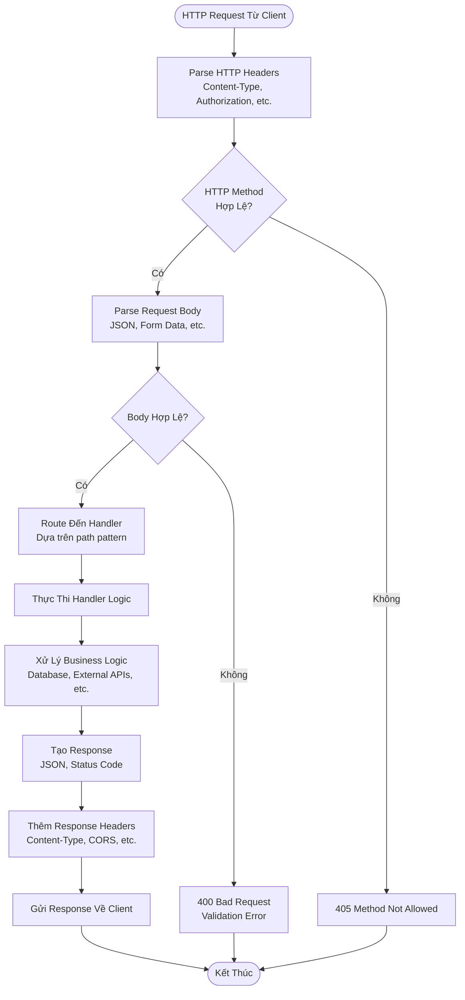

## Flow Khởi Động Server

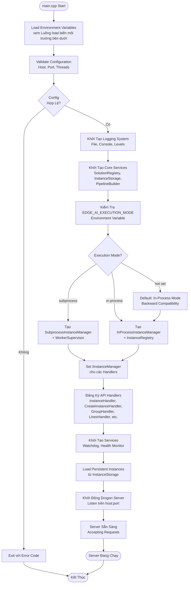

## Luồng load biến môi trường (Dev vs Production)

Biến môi trường được load **ngay đầu `main()`**, trước khi parse config và khởi tạo logging. Có hai nhánh chính: **Dev** (có `--dev` hoặc chạy ngoài production) và **Production** (binary dưới `/opt/edgeos-api`, không `--dev`).

### Sơ đồ quyết định load env

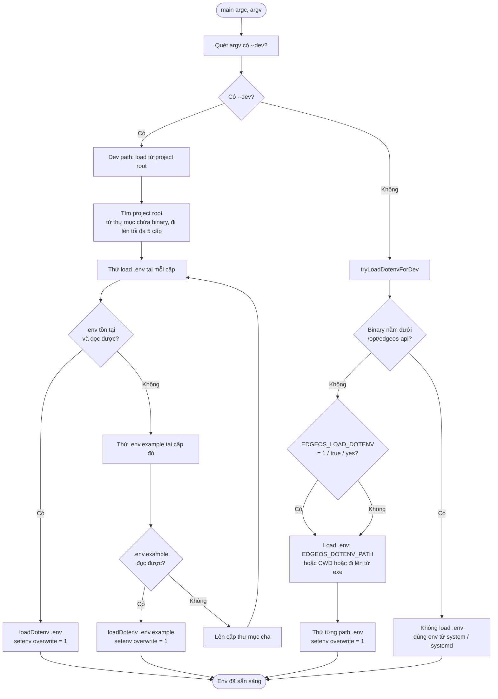

### Luồng Dev (có `--dev`)

| Bước | Mô tả |
|------|--------|
| 1 | Ứng dụng quét `argv` ngay đầu `main()`; nếu có `--dev` → gọi `EnvConfig::loadDotenvFromProjectRootOrExample(argv[0])`. |
| 2 | Tìm **project root**: từ thư mục chứa executable (ví dụ `build/bin/`) đi lên tối đa 5 cấp. |
| 3 | Tại mỗi cấp: thử đọc **`.env`**; nếu không có hoặc không đọc được → thử **`.env.example`**. |
| 4 | Đọc từng dòng `KEY=VALUE`, bỏ comment và dòng trống; gọi `setenv(KEY, VALUE, 1)` → **ghi đè** mọi giá trị env đã có. |
| 5 | Không cần chạy `load_env.sh` hay `source .env`; chỉ cần chạy `./build/bin/edgeos-api --dev`. |

**Nguồn config file khi dev:** Nếu chạy từ project root (CWD = repo), `resolveConfigPath()` sẽ ưu tiên `./config.json`. Có thể set `CONFIG_FILE` để trỏ tới file khác.

### Luồng Production (không `--dev`)

| Bước | Mô tả |
|------|--------|
| 1 | Không có `--dev` → gọi `EnvConfig::tryLoadDotenvForDev(argv[0])`. |
| 2 | Nếu binary nằm dưới **`/opt/edgeos-api`** → **không** load file `.env`; môi trường lấy từ **system** (systemd service, `Environment=` / `EnvironmentFile=`, hoặc env của user khi chạy tay). |
| 3 | Nếu cài đặt bằng .deb: thường có `/opt/edgeos-api/config/.env` hoặc env được set trong systemd; app đọc trực tiếp từ process environment. |
| 4 | Config file: ưu tiên `CONFIG_FILE`; nếu không set thì dùng `/opt/edgeos-api/config/config.json` (khi binary dưới `/opt/edgeos-api`). |

### Trường hợp không `--dev` nhưng chạy từ repo (dev không dùng cờ)

- Binary **không** nằm dưới `/opt/edgeos-api` → `tryLoadDotenvForDev` vẫn chạy.
- Thứ tự tìm `.env`: `EDGEOS_DOTENV_PATH` (nếu set) → **CWD** `.env` → đi lên từ thư mục chứa executable (tối đa 3 cấp), thử `.env` tại mỗi cấp.
- Set **`EDGEOS_LOAD_DOTENV=1`** để bắt buộc load `.env` kể cả khi binary nằm dưới `/opt/edgeos-api` (ít dùng).

### Tóm tắt nguồn env theo ngữ cảnh

| Ngữ cảnh | Cờ / Điều kiện | Nguồn biến môi trường |
|----------|-----------------|------------------------|
| **Dev** | `--dev` | `.env` hoặc `.env.example` từ **project root** (tìm từ đường dẫn executable), **ghi đè** env hiện có. |
| **Production** | Không `--dev`, binary dưới `/opt/edgeos-api` | System / systemd (không đọc file `.env` trong repo). |
| **Dev không cờ** | Không `--dev`, binary không dưới `/opt` | `tryLoadDotenvForDev`: có thể load `.env` từ `EDGEOS_DOTENV_PATH`, CWD, hoặc thư mục cha của exe. |

Sau khi env đã load, ứng dụng đọc **config file** (JSON) qua `resolveConfigPath()`; các giá trị trong config (ví dụ logging, execution mode) có thể bị override bởi env tương ứng (xem [ENVIRONMENT_VARIABLES.md](ENVIRONMENT_VARIABLES.md)).

## Background Services Flow

### Watchdog Service

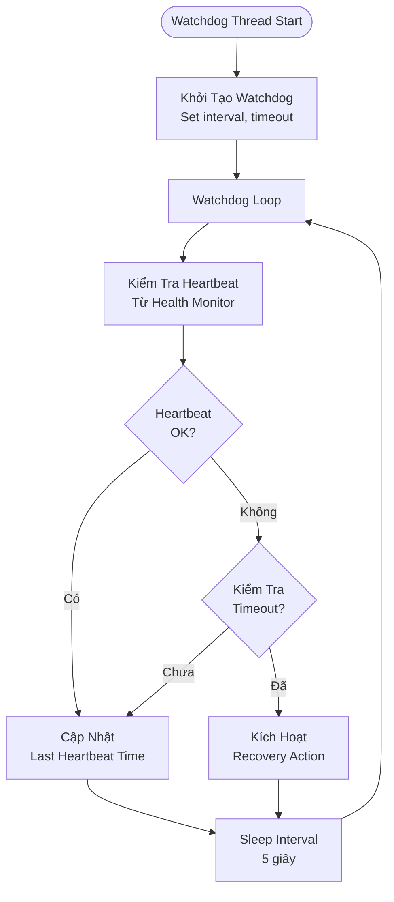

### Health Monitor Service

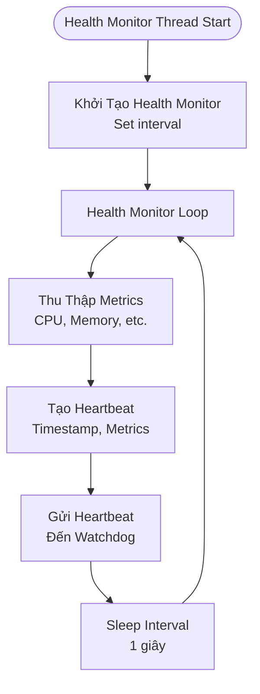

## Mô Tả Các Component

### REST API Server (Drogon Framework)

- **Chức năng**: HTTP server xử lý REST API requests
- **Port**: 8080 (mặc định), có thể cấu hình qua `API_PORT`
- **Host**: 0.0.0.0 (mặc định), có thể cấu hình qua `API_HOST`
- **Threads**: Auto-detect CPU cores, có thể cấu hình qua `THREAD_NUM`

### API Handlers

Tất cả API handlers sử dụng **IInstanceManager interface**, cho phép hoạt động với cả In-Process và Subprocess mode:

- **HealthHandler**: Health check endpoint (`/v1/core/health`)
- **VersionHandler**: Version information endpoint (`/v1/core/version`)
- **InstanceHandler**: Instance management endpoints (`/v1/core/instance/*`)
- **CreateInstanceHandler**: Create instance endpoint (`/v1/core/instance`)
- **SolutionHandler**: Solution management endpoints (`/v1/core/solution/*`)
- **GroupHandler**: Group management endpoints (`/v1/core/groups/*`)
- **LinesHandler**: Crossing lines management endpoints (`/v1/core/instance/{id}/lines/*`)
- **NodeHandler**: Node management endpoints (`/v1/core/node/*`)
- **RecognitionHandler**: Face recognition endpoints (`/v1/recognition/*`)
- **MetricsHandler**: Metrics endpoint (`/v1/core/metrics`)
- **SystemInfoHandler**: System information endpoints (`/v1/core/system/*`)
- **ConfigHandler**: Configuration endpoints (`/v1/core/config/*`)
- **LogHandler**: Logs access endpoints (`/v1/core/log/*`)
- **SwaggerHandler**: API documentation endpoints (`/swagger`, `/openapi.yaml`)

### Watchdog Service

- **Chức năng**: Giám sát health của server
- **Interval**: 5 giây (mặc định), có thể cấu hình qua `WATCHDOG_CHECK_INTERVAL_MS`
- **Timeout**: 30 giây (mặc định), có thể cấu hình qua `WATCHDOG_TIMEOUT_MS`
- **Recovery**: Tự động recovery khi phát hiện vấn đề

### Health Monitor Service

- **Chức năng**: Thu thập metrics và gửi heartbeat đến Watchdog
- **Interval**: 1 giây (mặc định), có thể cấu hình qua `HEALTH_MONITOR_INTERVAL_MS`
- **Metrics**: CPU usage, memory usage, request count, etc.

## API Endpoints Diagram

```mermaid
graph TB
    Client[Client] --> API[REST API Server]

    API --> Health["/v1/core/health"]
    API --> Version["/v1/core/version"]
    API --> Instances["/v1/core/instance"]
    API --> CreateInstance["POST /v1/core/instance"]
    API --> Solutions["/v1/core/solution"]
    API --> Groups["/v1/core/groups"]
    API --> Lines["/v1/core/instance/:id/lines"]
    API --> Nodes["/v1/core/node"]
    API --> Recognition["/v1/recognition"]
    API --> Metrics["/v1/core/metrics"]
    API --> SystemInfo["/v1/core/system"]
    API --> Config["/v1/core/config"]
    API --> Logs["/v1/core/log"]
    API --> Swagger["/swagger, /openapi.yaml"]

    Instances --> IList["GET /instances"]
    Instances --> IGet["GET /instances/:id"]
    Instances --> IUpdate["PUT /instances/:id"]
    Instances --> IDelete["DELETE /instances/:id"]
    Instances --> IStart["POST /instances/:id/start"]
    Instances --> IStop["POST /instances/:id/stop"]
    Instances --> IRestart["POST /instances/:id/restart"]
    Instances --> IBatch["POST /instances/batch/*"]
    Instances --> IConfig["GET/POST /instances/:id/config"]
    Instances --> IStats["GET /instances/:id/statistics"]

    Lines --> LList["GET /instances/:id/lines"]
    Lines --> LGet["GET /instances/:id/lines/:lineId"]
    Lines --> LCreate["POST /instances/:id/lines"]
    Lines --> LUpdate["PUT /instances/:id/lines/:lineId"]
    Lines --> LDelete["DELETE /instances/:id/lines/:lineId"]
    Lines --> LDeleteAll["DELETE /instances/:id/lines"]

    Solutions --> SList["GET /solutions"]
    Solutions --> SGet["GET /solutions/:id"]
    Solutions --> SCreate["POST /solutions"]
    Solutions --> SUpdate["PUT /solutions/:id"]
    Solutions --> SDelete["DELETE /solutions/:id"]

    Groups --> GList["GET /groups"]
    Groups --> GGet["GET /groups/:id"]
    Groups --> GCreate["POST /groups"]
    Groups --> GUpdate["PUT /groups/:id"]
    Groups --> GDelete["DELETE /groups/:id"]
    Groups --> GInstances["GET /groups/:id/instances"]
```

## Data Flow

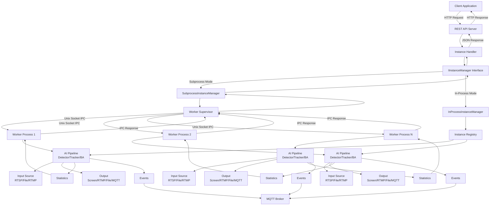

---

## Subprocess Architecture với Unix Socket IPC

### Tổng quan

edgeos-api hỗ trợ 2 chế độ thực thi (execution mode):

1. **In-Process Mode** (Legacy): Pipeline AI chạy trong cùng process với API server
2. **Subprocess Mode** (Production Default): Mỗi instance AI chạy trong worker process riêng biệt

**Lưu ý**: Khi build và cài đặt từ .deb package, production mặc định sử dụng **Subprocess Mode** để đảm bảo high availability, crash isolation, và hot reload capability.

### So sánh kiến trúc

#### In-Process Mode (Legacy)

```
┌─────────────────────────────────────────────────────┐
│                   Main Process                      │
│  ┌─────────────┐  ┌─────────────┐  ┌─────────────┐  │
│  │  REST API   │  │  Instance   │  │  Instance   │  │
│  │  Server     │  │  Pipeline A │  │  Pipeline B │  │
│  │  (Drogon)   │  │  (CVEDIX)   │  │  (CVEDIX)   │  │
│  └─────────────┘  └─────────────┘  └─────────────┘  │
│                                                     │
│  Shared Memory Space - Tất cả chạy trong 1 process  │
└─────────────────────────────────────────────────────┘
```

#### Subprocess Mode (Mới)

```
┌─────────────────────────────────────────────────────┐
│                   Main Process                      │
│  ┌─────────────┐  ┌─────────────────────────────┐   │
│  │  REST API   │  │   Worker Supervisor         │   │
│  │  Server     │◄─┤   - Spawn workers           │   │
│  │  (Drogon)   │  │   - Monitor health          │   │
│  └─────────────┘  │   - Auto-restart            │   │
│                   └─────────────────────────────┘   │
└────────────────────────────┬────────────────────────┘
                             │ Unix Socket IPC
        ┌────────────────────┼────────────────────┐
        ▼                    ▼                    ▼
┌───────────────┐   ┌───────────────┐   ┌───────────────┐
│ Worker A      │   │ Worker B      │   │ Worker C      │
│ ┌───────────┐ │   │ ┌───────────┐ │   │ ┌───────────┐ │
│ │ Pipeline  │ │   │ │ Pipeline  │ │   │ │ Pipeline  │ │
│ │ (CVEDIX)  │ │   │ │ (CVEDIX)  │ │   │ │ (CVEDIX)  │ │
│ └───────────┘ │   │ └───────────┘ │   │ └───────────┘ │
│ Isolated Mem  │   │ Isolated Mem  │   │ Isolated Mem  │
└───────────────┘   └───────────────┘   └───────────────┘
```

### So sánh ưu nhược điểm

| Tiêu chí | In-Process (Legacy) | Subprocess (Mới) |
|----------|---------------------|------------------|
| **Crash Isolation** | ❌ Crash 1 pipeline = crash toàn bộ server | ✅ Crash 1 worker không ảnh hưởng server/workers khác |
| **Memory Leak** | ❌ Leak tích lũy, phải restart server | ✅ Kill worker bị leak, spawn mới |
| **Hot Reload** | ❌ Phải restart toàn bộ server | ✅ Restart từng worker riêng lẻ |
| **Resource Limit** | ❌ Khó giới hạn CPU/RAM per instance | ✅ Có thể dùng cgroups/ulimit per worker |
| **Debugging** | ✅ Dễ debug trong 1 process | ⚠️ Phức tạp hơn (nhiều process) |
| **Latency** | ✅ Không overhead IPC | ⚠️ ~0.1-1ms overhead per IPC call |
| **Memory Usage** | ✅ Shared libraries, ít RAM hơn | ⚠️ Mỗi worker load riêng (~50-100MB/worker) |
| **Complexity** | ✅ Đơn giản | ⚠️ Phức tạp hơn (IPC, process management) |
| **Scalability** | ⚠️ Giới hạn bởi GIL-like issues | ✅ True parallelism |
| **Security** | ⚠️ Shared memory space | ✅ Process isolation |

### Chi tiết lợi ích Subprocess Mode

#### 1. Crash Isolation (Cô lập lỗi)

**Vấn đề với In-Process:**
```
Instance A crash (segfault trong GStreamer)
    → Toàn bộ server crash
    → Tất cả instances B, C, D đều dừng
    → Downtime cho toàn hệ thống
```

**Giải pháp với Subprocess:**
```
Worker A crash (segfault trong GStreamer)
    → Chỉ Worker A bị kill
    → Server vẫn chạy bình thường
    → Instances B, C, D không bị ảnh hưởng
    → WorkerSupervisor tự động spawn Worker A mới
    → Downtime chỉ cho Instance A (~2-3 giây)
```

#### 2. Memory Leak Handling

**Vấn đề với In-Process:**
- GStreamer/OpenCV có thể leak memory
- Memory tích lũy theo thời gian
- Phải restart toàn bộ server để giải phóng
- Ảnh hưởng tất cả instances

**Giải pháp với Subprocess:**
- Mỗi worker có memory space riêng
- Có thể monitor memory usage per worker
- Kill worker khi vượt ngưỡng, spawn mới
- Không ảnh hưởng workers khác

#### 3. Hot Reload

**Vấn đề với In-Process:**
- Update model → restart server
- Tất cả instances phải dừng và khởi động lại
- Downtime dài

**Giải pháp với Subprocess:**
- Update model cho Instance A → chỉ restart Worker A
- Instances B, C, D tiếp tục chạy
- Zero downtime cho hệ thống

#### 4. Resource Management

**Subprocess cho phép:**
```bash
# Giới hạn CPU per worker
taskset -c 0,1 ./edgeos-worker ...

# Giới hạn RAM per worker
ulimit -v 2000000  # 2GB max

# Sử dụng cgroups
cgcreate -g memory,cpu:edgeos-worker_1
cgset -r memory.limit_in_bytes=2G edgeos-worker_1
```

### Khi nào dùng mode nào?

Execution mode chi tiết và tối ưu ổn định: [task/edgeos-api/01_PHASE_OPTIMIZATION_STABILITY.md](../task/edgeos-api/01_PHASE_OPTIMIZATION_STABILITY.md).

#### Dùng In-Process khi:
- Development/debugging
- Số lượng instances ít (1-2)
- Cần latency thấp nhất
- Resource hạn chế (embedded device nhỏ)
- Instances ổn định, ít crash

#### Dùng Subprocess khi:
- Production environment
- Nhiều instances (3+)
- Cần high availability
- Instances có thể crash/leak
- Cần hot reload
- Cần resource isolation

### Cấu hình

#### Chọn Execution Mode

```bash
# In-Process mode (legacy, for development)
export EDGE_AI_EXECUTION_MODE=in-process
./edgeos-api

# Subprocess mode (production default)
export EDGE_AI_EXECUTION_MODE=subprocess
./edgeos-api
```

**Production Configuration**: Khi cài đặt từ .deb package, file `/opt/edgeos-api/config/.env` được tạo tự động với `EDGE_AI_EXECUTION_MODE=subprocess`. Systemd service sẽ load file này, đảm bảo production chạy Subprocess mode mặc định.

Để chuyển về In-Process mode trong production, sửa file `/opt/edgeos-api/config/.env`:
```bash
sudo nano /opt/edgeos-api/config/.env
# Thay đổi: EDGE_AI_EXECUTION_MODE=in-process
sudo systemctl restart edgeos-api
```

#### Cấu hình Worker

```bash
# Đường dẫn worker executable
export EDGE_AI_WORKER_PATH=/usr/bin/edgeos-worker

# Socket directory (default: /opt/edgeos-api/run)
export EDGE_AI_SOCKET_DIR=/opt/edgeos-api/run

# Max restart attempts
export EDGE_AI_MAX_RESTARTS=3

# Health check interval (ms)
export EDGE_AI_HEALTH_CHECK_INTERVAL=5000
```

### IPC Protocol

Communication giữa Main Process và Workers sử dụng Unix Domain Socket với binary protocol:

```
┌──────────────────────────────────────────────────┐
│                  Message Header (16 bytes)       │
├──────────┬─────────┬──────┬──────────┬───────────┤
│  Magic   │ Version │ Type │ Reserved │ Payload   │
│  (4B)    │  (1B)   │ (1B) │   (2B)   │ Size (8B) │
├──────────┴─────────┴──────┴──────────┴───────────┤
│                  JSON Payload                    │
│              (variable length)                   │
└──────────────────────────────────────────────────┘
```

#### Message Types:
- `PING/PONG` - Health check
- `CREATE_INSTANCE` - Tạo pipeline trong worker
- `START_INSTANCE` - Bắt đầu xử lý
- `STOP_INSTANCE` - Dừng xử lý
- `GET_STATUS` - Lấy trạng thái
- `GET_STATISTICS` - Lấy thống kê
- `GET_LAST_FRAME` - Lấy frame cuối
- `SHUTDOWN` - Tắt worker

### Performance Benchmarks

| Metric | In-Process | Subprocess | Overhead |
|--------|------------|------------|----------|
| API Response (create) | 5ms | 15ms | +10ms |
| API Response (status) | 0.5ms | 1.5ms | +1ms |
| Memory per instance | ~200MB shared | ~250MB isolated | +50MB |
| Startup time | 100ms | 500ms | +400ms |
| Recovery from crash | Manual restart | Auto 2-3s | N/A |

### Kết luận

Subprocess Architecture phù hợp cho production environment với yêu cầu:
- **High Availability**: Crash isolation, auto-restart
- **Maintainability**: Hot reload, independent updates
- **Scalability**: Resource isolation, true parallelism
- **Reliability**: Memory leak handling, health monitoring

Trade-off là complexity và overhead nhỏ (~10ms per API call, ~50MB RAM per worker), nhưng lợi ích về stability và maintainability vượt trội trong môi trường production.

### Instance Manager Interface

Tất cả API handlers sử dụng `IInstanceManager` interface, cho phép abstraction layer giữa handlers và execution backend:

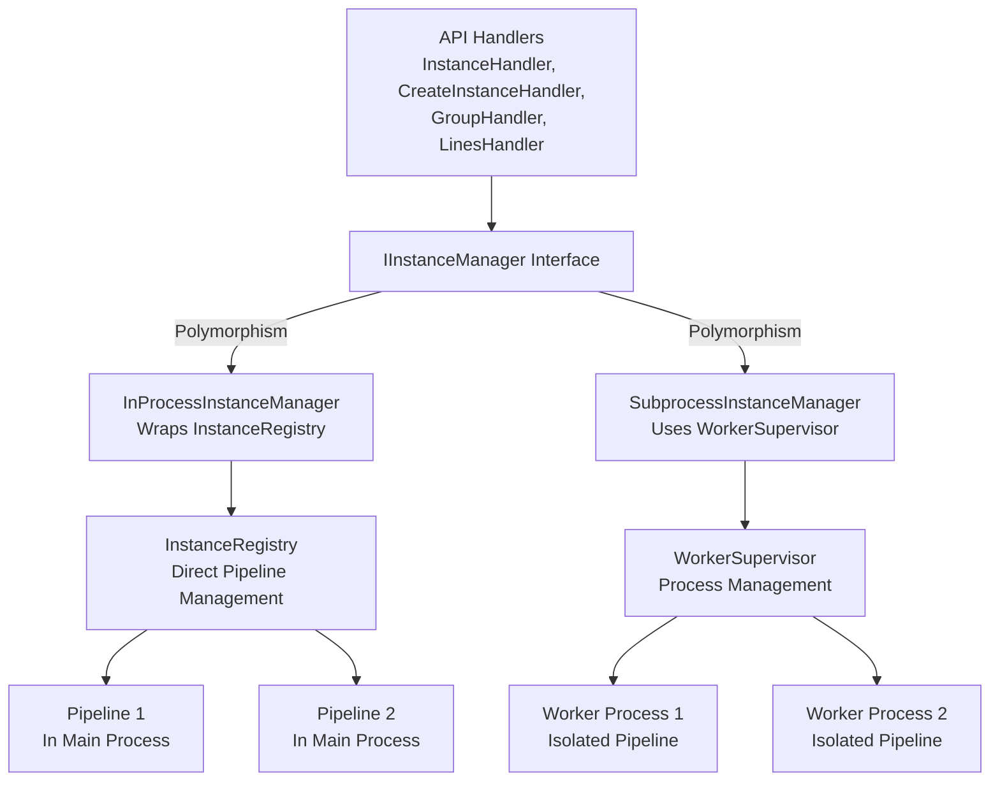

**Lợi ích của Interface Pattern**:
- Handlers không cần biết execution mode
- Dễ dàng switch giữa modes
- Code reuse và maintainability
- Test dễ dàng với mock implementations

**Production Setup**: Khi cài đặt từ .deb package:
- `edgeos-worker` executable được install vào `/usr/local/bin`
- File `/opt/edgeos-api/config/.env` được tạo với `EDGE_AI_EXECUTION_MODE=subprocess`
- Systemd service load `.env` file → production chạy Subprocess mode mặc định

---

## 📚 Xem Thêm

- [ENVIRONMENT_VARIABLES.md](ENVIRONMENT_VARIABLES.md) - Biến môi trường và cơ chế load .env (dev/production)
- [DEVELOPMENT.md](DEVELOPMENT.md) - Hướng dẫn phát triển chi tiết
- [API_document.md](API_document.md) - Tài liệu tham khảo API đầy đủ
- [AI_RUNTIME_DESIGN.md](AI_RUNTIME_DESIGN.md) - Thiết kế AI Runtime (InferenceSession, Facade)
- [VISION_AI_PROCESSING_PLATFORM.md](VISION_AI_PROCESSING_PLATFORM.md) - Vision nền tảng Edge AI
- [task/edgeos-api/00_MASTER_PLAN.md](../task/edgeos-api/00_MASTER_PLAN.md) - Master plan & trạng thái phases
