# Architecture & Flow Diagrams

Tài liệu này mô tả kiến trúc hệ thống và các flow diagram của omniapi.

## API → AI Runtime → SDK

Edge AI API định vị là **nền tảng Edge AI** (REST API + xử lý AI). CVEDIX SDK là tầng hỗ trợ; mọi luồng AI đi qua lớp **AI Runtime** (decode, inference, cache).

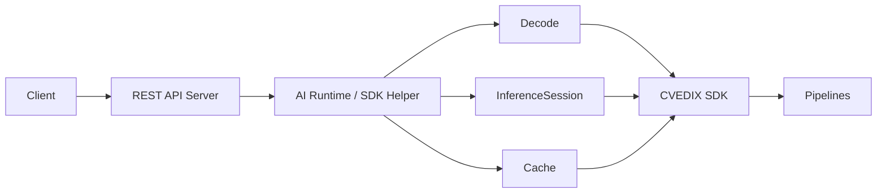

**Thành phần AI Runtime:**
- **InferenceSession** — Load/unload model, infer (face detector + recognizer).
- **AIRuntimeFacade** — Request (payload, codec, model_key) → decode → cache? → infer → response.
- **PipelineHelper** — Pipeline ngắn: frame → detector → callback (không dùng InstanceRegistry).

Recognition và Push frame dùng chung decode + infer qua facade/session. Xem [AI_RUNTIME_DESIGN.md](AI_RUNTIME_DESIGN.md).

## Kiến Trúc Phân Tầng (Layered Architecture)

Biểu đồ này cho thấy cách dòng chảy dữ liệu đi từ ngoài (Client) vào trong cùng của hệ thống (AI Core). Mỗi tầng có một trách nhiệm duy nhất (Single Responsibility).

```mermaid
flowchart TD
    %% Định nghĩa Client
    Client[Client / Web UI / Mobile App]

    %% Layer 1: API Gateway (Drogon HTTP Server)
    subgraph Layer1 [Layer 1: REST API Gateway]
        API_Server[Drogon HTTP Server
Port: 8080]
        Handler_Instance[Instance Handler
/v1/core/instance]
        Handler_System[System Handler
Health, Logs, System Info]
        
        API_Server --> Handler_Instance
        API_Server --> Handler_System
    end

    %% Layer 2: Quản lý vòng đời (Lifecycle Management)
    subgraph Layer2 [Layer 2: Execution Management]
        IInstanceManager{IInstanceManager
Interface}
        Mode_InProcess[InProcess Manager
(Legacy / Dev Mode)]
        Mode_Subprocess[Subprocess Manager
(Production Mode)]
        
        Handler_Instance --> IInstanceManager
        IInstanceManager .-> Mode_InProcess
        IInstanceManager .-> Mode_Subprocess
    end

    %% Layer 3: AI Runtime và SDK xử lý thực tế
    subgraph Layer3 [Layer 3: AI Runtime & CVEDIX SDK]
        WorkerSupervisor[Worker Supervisor
Quản lý các Worker process]
        
        subgraph Sub_Process_Isolation [Worker Processes (Cô lập)]
            Worker1[EdgeOS Worker 1
Camera A]
            Worker2[EdgeOS Worker 2
Camera B]
        end
        
        AI_Facade[AI Runtime Facade
Decode & Cache]
        InferSession[Inference Session
TensorRT / RKNN / ONNX]
        
        SDK[CVEDIX SDK
43+ Nodes Pipeline]
    end

    %% Luồng liên kết
    Client -- HTTP Request --> API_Server
    Mode_Subprocess --> WorkerSupervisor
    WorkerSupervisor == Unix Socket IPC ==> Worker1
    WorkerSupervisor == Unix Socket IPC ==> Worker2
    
    Worker1 --> AI_Facade
    AI_Facade --> InferSession
    InferSession --> SDK
    
    %% Style
    classDef client fill:#f9f,stroke:#333,stroke-width:2px;
    classDef layer fill:#e1f5fe,stroke:#01579b,stroke-width:2px;
    classDef core fill:#fff3e0,stroke:#e65100,stroke-width:2px;
    class Client client;
    class API_Server,Handler_Instance,Handler_System layer;
    class AI_Facade,InferSession,SDK core;
```

## Request Flow

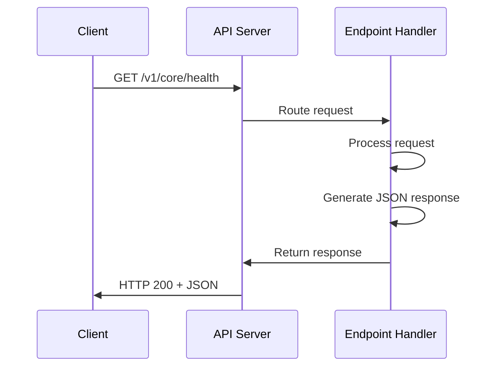

## Component Structure

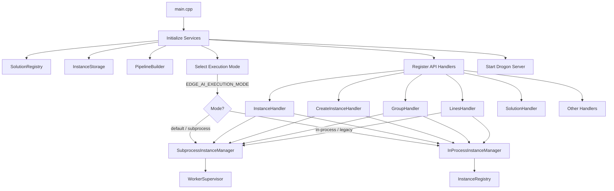

---

## Flow Tổng Quan Hệ Thống


## Vòng Đời Của 1 Request Trong Máy Chủ C++ (Drogon Framework)

Khi bạn dùng Postman gửi một lệnh gọi API, hệ thống C++ xử lý dữ liệu qua các bước sau để phản hồi cực mượt mà:

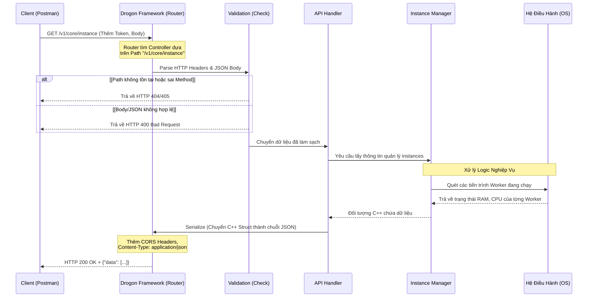

## Flow Khởi Động Server

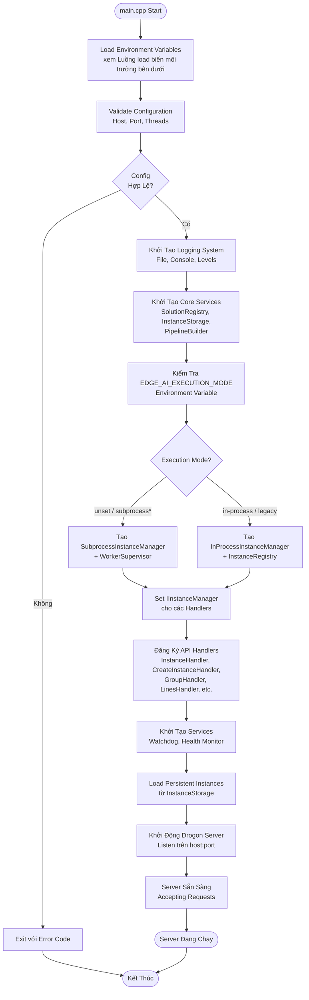

## "Bảo Mẫu" Hệ Thống (Watchdog & Health Monitor)

Hai luồng ngầm (Background Threads) này giúp đảm bảo Edge AI API có thể dùng ở Production 24/7/365 mà không sợ treo, tràn RAM hay đơ do lỗi nền tảng.

```mermaid
flowchart TD
    subgraph Background_Services [Các Dịch Vụ Ngầm Trong Main Process]
        
        subgraph Thread_Monitor [Luồng 1: Health Monitor]
            Collect[<b>Thu thập Metrics</b>
(Mỗi 1 giây)]
            Collect_RAM(Tính RAM) -.- Collect
            Collect_CPU(Tính CPU) -.- Collect
            
            SendHB[Gửi System Heartbeat
(Nhịp đập hệ thống)]
            Collect --> SendHB
        end
        
        subgraph Thread_Watchdog [Luồng 2: Watchdog Supervisor]
            CheckHB[<b>Kiểm tra Nhịp Đập</b>
(Mỗi 5 giây)]
            
            Cond_Alive{Nhịp đập
ổn không?}
            Cond_Timeout{Treo quá 
30 Giây?}
            
            Action_Save[Lưu lại
thời gian sống]
            Action_Recover((<b>KÍCH HOẠT
PHỤC HỒI</b>
Khởi động lại
các thành phần chết))
            
            CheckHB --> Cond_Alive
            Cond_Alive -->|Có nhịp đập| Action_Save
            Cond_Alive -->|Mất tín hiệu| Cond_Timeout
            
            Cond_Timeout -->|Chưa qua 30s| Action_Save
            Cond_Timeout -->|Đã qua 30s!| Action_Recover
        end

    end

    SendHB == "Tôi vẫn sống!" ==> CheckHB

    classDef danger fill:#ffeb3b,stroke:#f57f17,stroke-width:2px;
    class Action_Recover danger;
```

## Mô Tả Các Component

### REST API Server (Drogon Framework)

- **Chức năng**: HTTP server xử lý REST API requests
- **Port**: 8080 (mặc định), có thể cấu hình qua `API_PORT`
- **Host**: 0.0.0.0 (mặc định), có thể cấu hình qua `API_HOST`
- **Threads**: Auto-detect CPU cores, có thể cấu hình qua `THREAD_NUM`

### API Handlers

Tất cả API handlers sử dụng **IInstanceManager interface**, cho phép hoạt động với cả In-Process và Subprocess mode:

- **HealthHandler**: Health check endpoint (`/v1/core/health`)
- **VersionHandler**: Version information endpoint (`/v1/core/version`)
- **InstanceHandler**: Instance management endpoints (`/v1/core/instance/*`)
- **CreateInstanceHandler**: Create instance endpoint (`/v1/core/instance`)
- **SolutionHandler**: Solution management endpoints (`/v1/core/solution/*`)
- **GroupHandler**: Group management endpoints (`/v1/core/groups/*`)
- **LinesHandler**: Crossing lines management endpoints (`/v1/core/instance/{id}/lines/*`)
- **NodeHandler**: Node management endpoints (`/v1/core/node/*`)
- **RecognitionHandler**: Face recognition endpoints (`/v1/recognition/*`)
- **MetricsHandler**: Metrics endpoint (`/v1/core/metrics`)
- **SystemInfoHandler**: System information endpoints (`/v1/core/system/*`)
- **ConfigHandler**: Configuration endpoints (`/v1/core/config/*`)
- **LogHandler**: Logs access endpoints (`/v1/core/log/*`)
- **SwaggerHandler**: API documentation endpoints (`/swagger`, `/openapi.yaml`)

### Watchdog Service

- **Chức năng**: Giám sát health của server
- **Interval**: 5 giây (mặc định), có thể cấu hình qua `WATCHDOG_CHECK_INTERVAL_MS`
- **Timeout**: 30 giây (mặc định), có thể cấu hình qua `WATCHDOG_TIMEOUT_MS`
- **Recovery**: Tự động recovery khi phát hiện vấn đề

### Health Monitor Service

- **Chức năng**: Thu thập metrics và gửi heartbeat đến Watchdog
- **Interval**: 1 giây (mặc định), có thể cấu hình qua `HEALTH_MONITOR_INTERVAL_MS`
- **Metrics**: CPU usage, memory usage, request count, etc.

## API Endpoints Diagram

```mermaid
graph TB
    Client[Client] --> API[REST API Server]

    API --> Health["/v1/core/health"]
    API --> Version["/v1/core/version"]
    API --> Instances["/v1/core/instance"]
    API --> CreateInstance["POST /v1/core/instance"]
    API --> Solutions["/v1/core/solution"]
    API --> Groups["/v1/core/groups"]
    API --> Lines["/v1/core/instance/:id/lines"]
    API --> Nodes["/v1/core/node"]
    API --> Recognition["/v1/recognition"]
    API --> Metrics["/v1/core/metrics"]
    API --> SystemInfo["/v1/core/system"]
    API --> Config["/v1/core/config"]
    API --> Logs["/v1/core/log"]
    API --> Swagger["/swagger, /openapi.yaml"]

    Instances --> IList["GET /instances"]
    Instances --> IGet["GET /instances/:id"]
    Instances --> IUpdate["PUT /instances/:id"]
    Instances --> IDelete["DELETE /instances/:id"]
    Instances --> IStart["POST /instances/:id/start"]
    Instances --> IStop["POST /instances/:id/stop"]
    Instances --> IRestart["POST /instances/:id/restart"]
    Instances --> IBatch["POST /instances/batch/*"]
    Instances --> IConfig["GET/POST /instances/:id/config"]
    Instances --> IStats["GET /instances/:id/statistics"]

    Lines --> LList["GET /instances/:id/lines"]
    Lines --> LGet["GET /instances/:id/lines/:lineId"]
    Lines --> LCreate["POST /instances/:id/lines"]
    Lines --> LUpdate["PUT /instances/:id/lines/:lineId"]
    Lines --> LDelete["DELETE /instances/:id/lines/:lineId"]
    Lines --> LDeleteAll["DELETE /instances/:id/lines"]

    Solutions --> SList["GET /solutions"]
    Solutions --> SGet["GET /solutions/:id"]
    Solutions --> SCreate["POST /solutions"]
    Solutions --> SUpdate["PUT /solutions/:id"]
    Solutions --> SDelete["DELETE /solutions/:id"]

    Groups --> GList["GET /groups"]
    Groups --> GGet["GET /groups/:id"]
    Groups --> GCreate["POST /groups"]
    Groups --> GUpdate["PUT /groups/:id"]
    Groups --> GDelete["DELETE /groups/:id"]
    Groups --> GInstances["GET /groups/:id/instances"]
```

## Data Flow

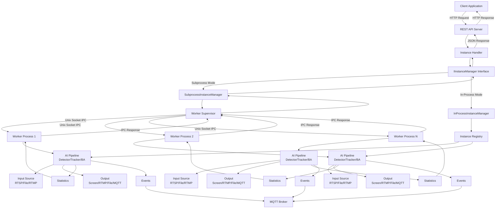

## Luồng Dữ Liệu Trong 1 Camera (AI Pipeline Data Flow)

Khi một Worker Process được bật lên, nó sẽ nạp CVEDIX SDK để thiết lập một "đường ống" (Pipeline) xử lý liên tục. Đây là cách 1 khung hình (frame) đi từ Camera cho đến khi ra được cảnh báo:

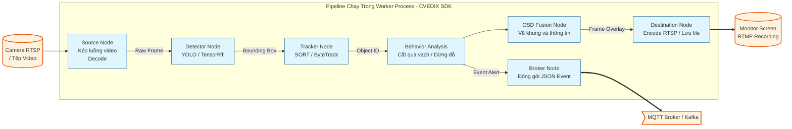

---

## Luồng Cập Nhật Instance Tại Runtime (Zero-Downtime Hot Reload)

Khi người dùng cập nhật cấu hình của một instance (ví dụ: thay đổi tọa độ vạch kẻ `CrossingLines` hoặc `CROSSLINE_`), hệ thống có khả năng áp dụng cấu hình mới trực tiếp vào pipeline đang chạy mà không cần tái tạo hay khởi động lại (restart) quá trình xử lý, giúp giữ nguyên uptime và không gây gián đoạn luồng video phân tích.

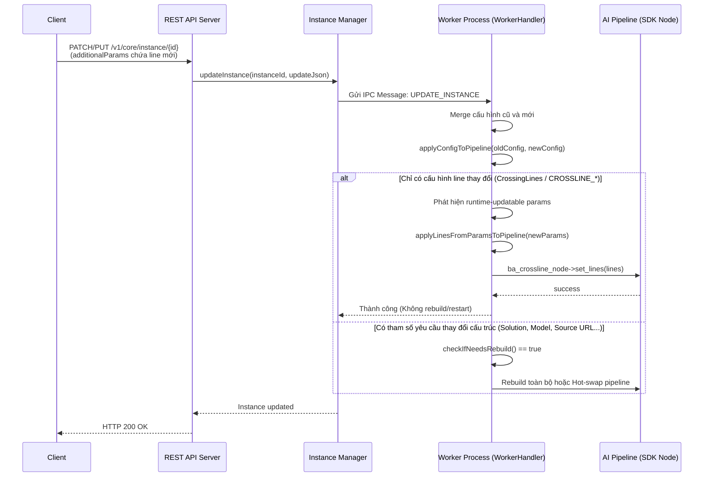

**Các đặc điểm chính của kỹ thuật Hot Reload trên Worker:**
1. **Không buộc rebuild:** Hàm `checkIfNeedsRebuild()` liệt kê các thay đổi về tọa độ `CrossingLines` (hoặc prefix `CROSSLINE_`) là các tham số an toàn, **không** trigger quá trình rebuild toàn bộ cỗ máy pipeline.
2. **Flatten & Extract Params:** Khi nhận update, `getParamsFromConfig()` hỗ trợ rút trích (`flatten`) tham số đầu vào (`additionalParams`, `input`) thành tập key-value phẳng, từ đó `applyConfigToPipeline()` có thể so sánh và áp dụng cực kỳ nhanh chóng.
3. **Cập nhật SDK trực tiếp `set_lines()`:** Thay vì khởi tạo lại, tiến trình kiểm tra `CrossingLines` dạng JSON array (hoặc `CROSSLINE_START/END_X/Y`), tạo cấu trúc đối tượng `cvedix_line` và bơm trực tiếp thông qua hàm `set_lines()` của Node `ba_crossline_node` trong SDK. Sự thay đổi có hiệu lực ngay tại frame tiếp theo.

**Pipeline Swap (Update khi cần rebuild):** Khi cần rebuild pipeline (thay đổi solution/model/source), worker thực hiện **stop old → build new → start new** (không còn “atomic swap” để tránh mất output RTMP):
- **PipelineSnapshot**: Mỗi pipeline là một snapshot bất biến (danh sách node). Runtime đọc pipeline đang active qua `getActivePipeline()` (shared lock).
- **Thứ tự swap (fix mất stream sau update):** (1) Dừng pipeline cũ và giải phóng kết nối output (RTMP/rtmp_des) trước. (2) Build pipeline mới. (3) Gán pipeline mới làm active, setup hooks, rồi start source. Nhờ đó rtmp_des mới kết nối được tới server (stream key đã được giải phóng), tránh lỗi “instance vẫn chạy nhưng mất output” sau PATCH/PUT. Có **gap ngắn** (vài giây) không có stream trong lúc build + start.
- **Memory safety**: Pipeline cũ được giữ bằng `shared_ptr`; sau khi stop source và `stopSourceNodeForSnapshot()`, destructor gọi `detach_recursively()` để giải phóng tài nguyên.

**Giữ kết nối stream (RTMP) trong lúc update (Last-Frame Pump):** Khi hot swap bắt buộc rebuild pipeline, output RTMP có thể bị ngắt (pipeline cũ teardown → rtmp_des mất). Để tránh server stream mất stream key, có thể dùng **last-frame** để tiếp tục gửi trong lúc swap:
- **RtmpLastFrameFallbackProxyNode** đã có `inject_frame(cv::Mat)`: cho phép bơm frame từ bên ngoài vào proxy (gọi `meta_flow(meta)`), proxy forward xuống rtmp_des. Worker đã có `last_frame_` (capture từ hook).
- **Option A (zero-gap):** Giữ pipeline cũ **chỉ phần proxy + rtmp_des**; tách upstream (OSD) khỏi proxy. Chạy thread "last-frame pump" định kỳ gọi `proxy->inject_frame(last_frame_)`. Build pipeline mới sao cho output OSD **gắn vào cùng proxy** (không tạo rtmp_des mới). Sau khi pipeline mới chạy ổn, dừng pump. Cần pipeline builder hỗ trợ "reuse existing proxy" (attach OSD vào proxy có sẵn).
- **Option B (minimize gap):** Sau khi dừng pipeline cũ, chạy sender tạm chỉ gửi last-frame tới cùng RTMP URL cho đến khi pipeline mới kết nối; gap ngắn khi chuyển.

**Full design (zero-downtime, no RTMP reconnect):** [ZERO_DOWNTIME_ATOMIC_PIPELINE_SWAP_DESIGN.md](ZERO_DOWNTIME_ATOMIC_PIPELINE_SWAP_DESIGN.md) — persistent output leg (proxy + rtmp_des), frame router, atomic pipeline swap, drain, last-frame pump, threading, memory safety, logging.

---

## Kiến Trúc Hot Swap & Zero-Downtime (Chuyển giao công nghệ)

**Tóm tắt một dòng:** Khi bạn PATCH cấu hình instance (ví dụ đổi vạch kẻ đường), hệ thống **xây pipeline mới song song**, rồi **đổi sang pipeline mới trong một bước** trong khi **giữ nguyên một kết nối RTMP** ra server — luồng phát không bị ngắt, người xem không thấy gián đoạn.

Phần này mô tả **cơ chế cập nhật cấu hình instance (PATCH/PUT) mà không ngắt luồng phát RTMP** — dành cho người mới và người không chuyên lập trình.

### Mục đích (dễ hiểu)

- **Vấn đề:** Khi đổi cấu hình (ví dụ thêm/sửa vạch kẻ đường), nếu tắt pipeline cũ rồi mới bật pipeline mới thì luồng RTMP ra ngoài sẽ bị **ngắt** vài giây.
- **Mục tiêu:** Cập nhật cấu hình **trong khi luồng RTMP vẫn liên tục** — không ngắt kết nối, người xem không thấy gián đoạn.

### Ý tưởng chính (3 điểm)

1. **Đầu ra RTMP cố định:** Một kết nối RTMP ra server (rtmp_des) và một "cổng" nhận frame (RtmpLastFrameFallbackProxyNode) được **giữ nguyên** khi cập nhật.
2. **Chỉ đổi "đoạn xử lý AI":** Phần Source → Decoder → Detector → Tracker → OSD được **thay thế** bằng pipeline mới; đầu ra luôn nối vào **Frame Router** rồi vào "cổng" RTMP.
3. **Bơm frame dự phòng:** Trong lúc chuyển pipeline, hệ thống tạm **bơm frame cuối cùng** vào "cổng" RTMP để server vẫn nhận dữ liệu.

### Sơ đồ luồng dữ liệu trong Worker

**Sơ đồ dạng text** (khi không xem được Mermaid):

```
  Camera/RTSP ──► Source ──► Decoder ──► [AI Leg: Detector→Tracker→OSD] ──► Frame Router
                                                                                  │
  Last-Frame Pump (khi swap) ─────────────────────────────────────────────────────┤
                                                                                  ▼
                                                                         Proxy (cố định) ──► rtmp_des ──► Server RTMP
```

- **AI Leg** có thể là pipeline cũ hoặc mới; **Frame Router** chỉ chọn pipeline đang active và đẩy frame xuống Proxy.
- **Proxy + rtmp_des** không đổi trong suốt quá trình hot swap.

**Sơ đồ Mermaid:**

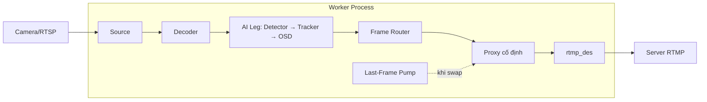

### Chuỗi thao tác Hot Swap

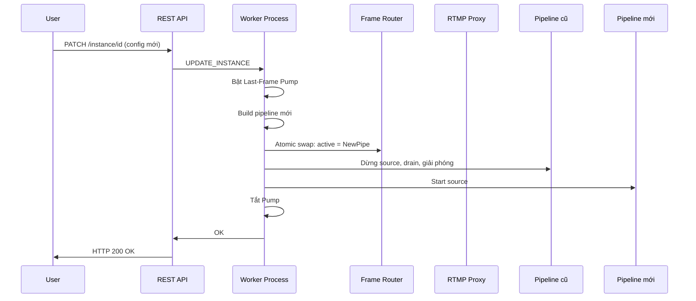

### Hot Swap là cơ chế đặc trưng của hệ thống

Hệ thống **ưu tiên hot swap (zero downtime)** cho mọi cập nhật cấu hình instance; **restart chỉ là biện pháp cuối** khi hot swap không khả dụng (ví dụ instance chưa chạy).

- **PATCH/PUT instance:** Worker dùng hot swap khi cần rebuild (zone, model, source, line…); line-only có thể dùng `set_lines()` tại runtime, hoặc hot swap nếu có RTMP.
- **Lines / Jams / Stops (API chuyên biệt):** Cập nhật runtime (IPC hoặc set_lines/set_jams) được thử trước; **nếu thất bại thì fallback là hot swap** (gửi UPDATE_INSTANCE với config đã merge), **không còn fallback restart** trong luồng thường.
- **SecuRT Lines:** Tương tự — update qua IPC trước, thất bại thì áp dụng qua hot swap (CrossingLines từ SecuRT).
- **Worker UPDATE_LINES:** Nếu `set_lines()` thất bại hoặc exception, worker tự fallback hot swap (merge CrossingLines vào config và gọi `hotSwapPipeline`), trả về thành công thay vì lỗi.

Nhờ đó, **mọi thay đổi line/zone đều đi qua hot swap** khi có thể, giữ stream RTMP và trải nghiệm người dùng liên tục.

### Khi nào dùng Hot Swap?

| Loại cập nhật | Hành vi |
|---------------|--------|
| Chỉ thay đổi line (CrossingLines) và có output RTMP | Hot swap (build mới → swap → drain cũ) |
| Chỉ thay đổi line, không có RTMP | Áp dụng runtime qua set_lines() |
| Thay đổi solution, model, source URL... | Hot swap |
| Lines/Jams/Stops API: runtime update thất bại | Fallback **hot swap** (updateInstanceFromConfig), không restart |

### Các thay đổi code chính (hot swap chạy đúng)

1. **Sửa OSD chỉ hiển thị 1 line**  
   **File:** `src/core/pipeline_builder_behavior_analysis_nodes.cpp`, hàm `createBACrosslineOSDNode`.  
   Fallback legacy (CROSSLINE_START/END_X/Y) chỉ chạy khi **chưa** set line từ CrossingLines (`!osdLinesSetFromCrossingLines`); tránh ghi đè nhiều line xuống 1 line sau PATCH.

2. **Log worker ra file riêng**  
   **File:** `src/worker/worker_supervisor.cpp`, trong `spawnWorker` (nhánh child trước `execl`).  
   Redirect stdout/stderr của worker vào `logs/worker_<instance_id>.log` (hoặc `$LOG_DIR/worker_<instance_id>.log`); dễ xem log `[Worker:...]` (UPDATE_INSTANCE, hot swap, start/stop).

**Chi tiết kỹ thuật (threading, lock, pseudo-code):** [ZERO_DOWNTIME_ATOMIC_PIPELINE_SWAP_DESIGN.md](ZERO_DOWNTIME_ATOMIC_PIPELINE_SWAP_DESIGN.md).

---

## Subprocess Architecture với Unix Socket IPC

### Tổng quan

omniapi hỗ trợ 2 chế độ thực thi (execution mode):

1. **In-Process Mode** (Legacy): Pipeline AI chạy trong cùng process với API server
2. **Subprocess Mode** (Production Default): Mỗi instance AI chạy trong worker process riêng biệt

**Lưu ý**: Khi build và cài đặt từ .deb package, production mặc định sử dụng **Subprocess Mode** để đảm bảo high availability, crash isolation, và hot reload capability.

### So sánh kiến trúc

#### Hình Ảnh So Sánh Sự Cô Lập Giữa 2 Execution Modes

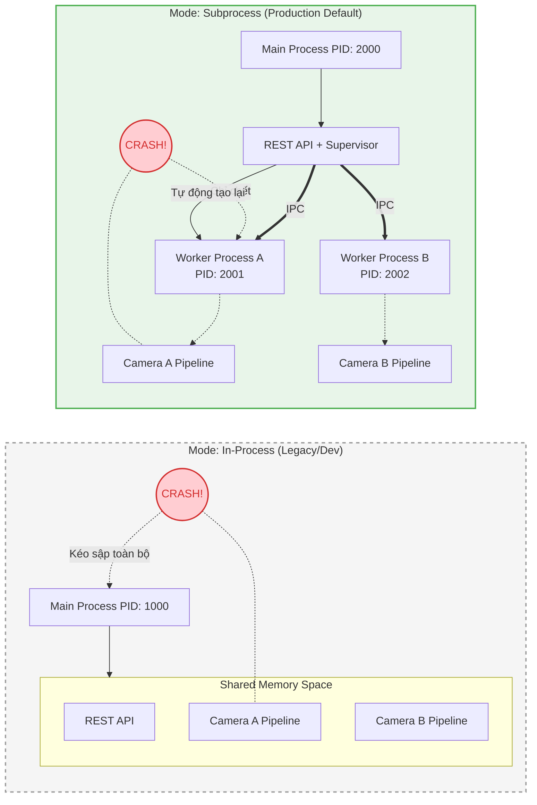

### So sánh ưu nhược điểm

| Tiêu chí | In-Process (Legacy) | Subprocess (Mới) |
|----------|---------------------|------------------|
| **Crash Isolation** | ❌ Crash 1 pipeline = crash toàn bộ server | ✅ Crash 1 worker không ảnh hưởng server/workers khác |
| **Memory Leak** | ❌ Leak tích lũy, phải restart server | ✅ Kill worker bị leak, spawn mới |
| **Hot Reload** | ❌ Phải restart toàn bộ server | ✅ Restart từng worker riêng lẻ |
| **Resource Limit** | ❌ Khó giới hạn CPU/RAM per instance | ✅ Có thể dùng cgroups/ulimit per worker |
| **Debugging** | ✅ Dễ debug trong 1 process | ⚠️ Phức tạp hơn (nhiều process) |
| **Latency** | ✅ Không overhead IPC | ⚠️ ~0.1-1ms overhead per IPC call |
| **Memory Usage** | ✅ Shared libraries, ít RAM hơn | ⚠️ Mỗi worker load riêng (~50-100MB/worker) |
| **Complexity** | ✅ Đơn giản | ⚠️ Phức tạp hơn (IPC, process management) |
| **Scalability** | ⚠️ Giới hạn bởi GIL-like issues | ✅ True parallelism |
| **Security** | ⚠️ Shared memory space | ✅ Process isolation |

### Chi tiết lợi ích Subprocess Mode

#### 1. Crash Isolation (Cô lập lỗi)

**Vấn đề với In-Process:**
```
Instance A crash (segfault trong GStreamer)
    → Toàn bộ server crash
    → Tất cả instances B, C, D đều dừng
    → Downtime cho toàn hệ thống
```

**Giải pháp với Subprocess:**
```
Worker A crash (segfault trong GStreamer)
    → Chỉ Worker A bị kill
    → Server vẫn chạy bình thường
    → Instances B, C, D không bị ảnh hưởng
    → WorkerSupervisor tự động spawn Worker A mới
    → Downtime chỉ cho Instance A (~2-3 giây)
```

#### 2. Memory Leak Handling

**Vấn đề với In-Process:**
- GStreamer/OpenCV có thể leak memory
- Memory tích lũy theo thời gian
- Phải restart toàn bộ server để giải phóng
- Ảnh hưởng tất cả instances

**Giải pháp với Subprocess:**
- Mỗi worker có memory space riêng
- Có thể monitor memory usage per worker
- Kill worker khi vượt ngưỡng, spawn mới
- Không ảnh hưởng workers khác

#### 3. Hot Reload

**Vấn đề với In-Process:**
- Update model → restart server
- Tất cả instances phải dừng và khởi động lại
- Downtime dài

**Giải pháp với Subprocess:**
- Update model cho Instance A → chỉ restart Worker A
- Instances B, C, D tiếp tục chạy
- Zero downtime cho hệ thống

#### 4. Resource Management

**Subprocess cho phép:**
```bash
# Giới hạn CPU per worker
taskset -c 0,1 ./edgeos-worker ...

# Giới hạn RAM per worker
ulimit -v 2000000  # 2GB max

# Sử dụng cgroups
cgcreate -g memory,cpu:edgeos-worker_1
cgset -r memory.limit_in_bytes=2G edgeos-worker_1
```

### Khi nào dùng mode nào?

Execution mode chi tiết và tối ưu ổn định: [task/omniapi/01_PHASE_OPTIMIZATION_STABILITY.md](../task/omniapi/01_PHASE_OPTIMIZATION_STABILITY.md).

#### Dùng In-Process khi:
- Development/debugging
- Số lượng instances ít (1-2)
- Cần latency thấp nhất
- Resource hạn chế (embedded device nhỏ)
- Instances ổn định, ít crash

#### Dùng Subprocess khi:
- Production environment
- Nhiều instances (3+)
- Cần high availability
- Instances có thể crash/leak
- Cần hot reload
- Cần resource isolation

### Cấu hình

#### Chọn Execution Mode

```bash
# Subprocess (mặc định khi không set biến — khuyến nghị production)
./omniapi
# hoặc export EDGE_AI_EXECUTION_MODE=subprocess

# In-Process (legacy, chỉ khi cần debug / tương thích cũ)
export EDGE_AI_EXECUTION_MODE=in-process
./omniapi
```

**Production Configuration**: Khi cài đặt từ .deb package, file `/opt/omniapi/config/.env` dùng `EDGE_AI_EXECUTION_MODE=subprocess`. Dù không có dòng này, binary cũng mặc định subprocess.

Để bật In-Process (legacy), sửa `/opt/omniapi/config/.env`:
```bash
sudo nano /opt/omniapi/config/.env
# Thêm hoặc đổi: EDGE_AI_EXECUTION_MODE=in-process
sudo systemctl restart omniapi
```

#### Cấu hình Worker

```bash
# Đường dẫn worker executable
export EDGE_AI_WORKER_PATH=/usr/bin/edgeos-worker

# Socket directory (default: /opt/omniapi/run)
export EDGE_AI_SOCKET_DIR=/opt/omniapi/run

# Max restart attempts
export EDGE_AI_MAX_RESTARTS=3

# Health check interval (ms)
export EDGE_AI_HEALTH_CHECK_INTERVAL=5000
```

### IPC Protocol

Communication giữa Main Process và Workers sử dụng Unix Domain Socket với binary protocol:

```
┌──────────────────────────────────────────────────┐
│                  Message Header (16 bytes)       │
├──────────┬─────────┬──────┬──────────┬───────────┤
│  Magic   │ Version │ Type │ Reserved │ Payload   │
│  (4B)    │  (1B)   │ (1B) │   (2B)   │ Size (8B) │
├──────────┴─────────┴──────┴──────────┴───────────┤
│                  JSON Payload                    │
│              (variable length)                   │
└──────────────────────────────────────────────────┘
```

#### Message Types:
- `PING/PONG` - Health check
- `CREATE_INSTANCE` - Tạo pipeline trong worker
- `START_INSTANCE` - Bắt đầu xử lý
- `STOP_INSTANCE` - Dừng xử lý
- `GET_STATUS` - Lấy trạng thái
- `GET_STATISTICS` - Lấy thống kê
- `GET_LAST_FRAME` - Lấy frame cuối
- `SHUTDOWN` - Tắt worker

### API responsiveness (subprocess)

Trong subprocess mode, GET instance / list instance **không** block trên IPC: `getInstance()` chỉ trả về cache, không gọi `getInstanceStatistics()` (sendToWorker) trên luồng xử lý request. Nhờ đó các API khác vẫn dùng bình thường khi instance đang chạy. Endpoint GET `/v1/core/instance/{id}/statistics` vẫn gọi IPC khi cần FPS/thống kê mới.

### Pipeline runtime: một lệnh start và cập nhật theo config

**Một lệnh start là đủ (build-if-needed rồi chạy):**

- Bạn **không bắt buộc** phải gọi "create" rồi mới "start". Worker khi nhận **START_INSTANCE** sẽ:
  - Nếu **đã có pipeline** (đã build trước đó) → start ngay (async).
  - Nếu **chưa có pipeline** nhưng **có config** (SolutionId, AdditionalParams, v.v.) → **tự build pipeline từ config** rồi start.
- Từ phía API: **POST /v1/core/instance/{id}/start** một lần là đủ; nếu worker chưa build thì nó tự build rồi chạy. Pipeline vẫn cần được "build" (tạo nodes, kết nối) trước khi chạy vì CVEDIX pipeline là đồ thị nodes cố định, nhưng thao tác của bạn chỉ cần một lệnh **start**.

**Khi thay đổi config thì pipeline cập nhật theo:**

- **Cập nhật tại runtime (không restart):** Một số thay đổi được áp dụng **ngay trên pipeline đang chạy** qua SDK (ví dụ `set_lines()`):
  - **CrossingLines / CROSSLINE_*** (vị trí line) → áp dụng ngay, không rebuild.
  - Các tham số khác mà CVEDIX node hỗ trợ set runtime (nếu có) cũng có thể được mở rộng tương tự.
- **Cập nhật cần rebuild hoặc hot-swap:** Thay đổi **cấu trúc** (solution, model path, source URL, Zone, v.v.) → worker dùng **hot-swap** (build pipeline mới song song rồi đổi) hoặc **stop → build → start** để áp dụng. Pipeline vẫn "update theo" config, nhưng qua bước rebuild/hot-swap thay vì chỉ set runtime.

Tóm lại: **start** = build nếu chưa có rồi chạy; **update config** = áp dụng runtime khi có thể, còn không thì rebuild/hot-swap để pipeline luôn khớp config.

### Architecture: Bật/Tắt Face Detection theo từng Instance

Hệ thống hỗ trợ bật/tắt face detection ở mức **mỗi instance** qua endpoint:

- `POST /v1/core/instance/{instanceId}/face_detection`
- Body: `{ "enable": true | false }`

Luồng xử lý chính:

1. API nhận request và validate `instanceId`, `enable`.
2. `InstanceHandler::setFaceDetection` ghi vào `AdditionalParams`:
   - `ENABLE_FACE_DETECTION = "true" | "false"`
   - `SECURT_FACE_DETECTION_ENABLE = "true" | "false"`
3. Gọi `updateInstanceFromConfig(instanceId, partialConfig)` để merge config mới vào instance config hiện tại.
4. Instance manager/worker quyết định cách áp dụng:
   - Nếu node hỗ trợ update runtime trực tiếp thì apply nóng.
   - Nếu thay đổi ảnh hưởng cấu trúc pipeline thì hot-swap hoặc rebuild theo cơ chế update pipeline hiện có.

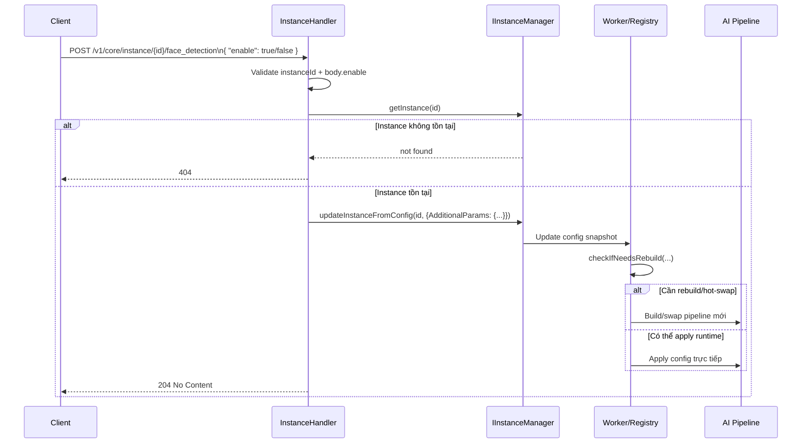

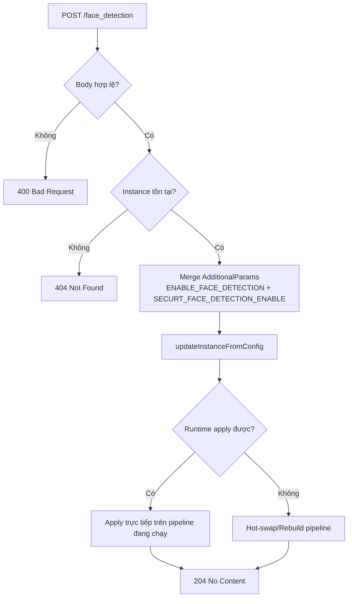

**Lưu ý vận hành:**
- Cờ face detection được lưu ở config instance nên trạng thái bật/tắt được giữ nhất quán qua vòng đời instance.
- Với instance đang chạy, thay đổi được áp dụng theo cơ chế update pipeline hiện có (runtime apply hoặc hot-swap/rebuild).
- Endpoint này chỉ điều khiển **face detection của instance cụ thể**, không ảnh hưởng các instance khác.

### Performance Benchmarks

| Metric | In-Process | Subprocess | Overhead |
|--------|------------|------------|----------|
| API Response (create) | 5ms | 15ms | +10ms |
| API Response (status) | 0.5ms | 1.5ms | +1ms |
| Memory per instance | ~200MB shared | ~250MB isolated | +50MB |
| Startup time | 100ms | 500ms | +400ms |
| Recovery from crash | Manual restart | Auto 2-3s | N/A |

### Kết luận

Subprocess Architecture phù hợp cho production environment với yêu cầu:
- **High Availability**: Crash isolation, auto-restart
- **Maintainability**: Hot reload, independent updates
- **Scalability**: Resource isolation, true parallelism
- **Reliability**: Memory leak handling, health monitoring

Trade-off là complexity và overhead nhỏ (~10ms per API call, ~50MB RAM per worker), nhưng lợi ích về stability và maintainability vượt trội trong môi trường production.

### Cấu Trúc Interfaces: Abstract Factory Pattern

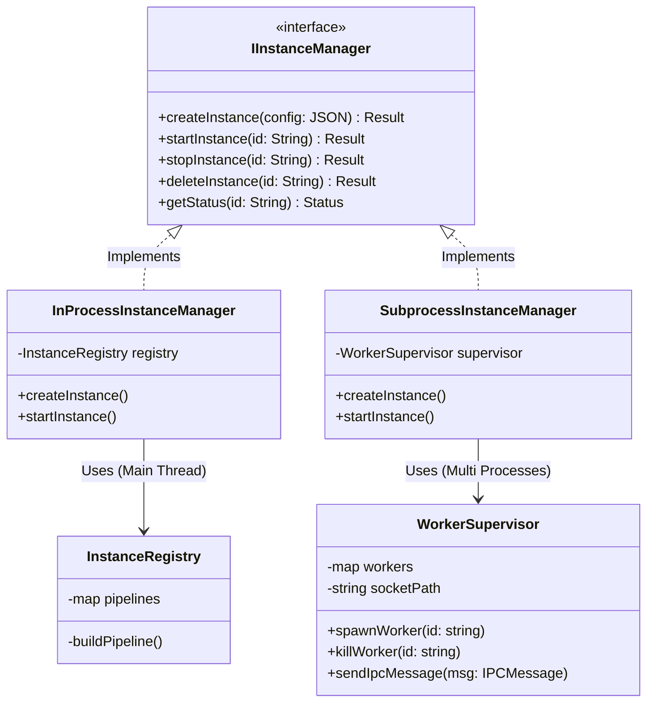

**Lợi ích của Interface Pattern**:
- Handlers không cần biết execution mode
- Dễ dàng switch giữa modes
- Code reuse và maintainability
- Test dễ dàng với mock implementations

**Production Setup**: Khi cài đặt từ .deb package:
- `edgeos-worker` executable được install vào `/usr/local/bin`
- File `/opt/omniapi/config/.env` được tạo với `EDGE_AI_EXECUTION_MODE=subprocess`
- Systemd service load `.env` file → production chạy Subprocess mode mặc định

---

## 📚 Xem Thêm

- [ENVIRONMENT_VARIABLES.md](ENVIRONMENT_VARIABLES.md) - Biến môi trường và cơ chế load .env (dev/production)
- [DEVELOPMENT.md](DEVELOPMENT.md) - Hướng dẫn phát triển chi tiết
- [API_document.md](API_document.md) - Tài liệu tham khảo API đầy đủ
- [AI_RUNTIME_DESIGN.md](AI_RUNTIME_DESIGN.md) - Thiết kế AI Runtime (InferenceSession, Facade)
- [VISION_AI_PROCESSING_PLATFORM.md](VISION_AI_PROCESSING_PLATFORM.md) - Vision nền tảng Edge AI
- [task/omniapi/00_MASTER_PLAN.md](../task/omniapi/00_MASTER_PLAN.md) - Master plan & trạng thái phases
